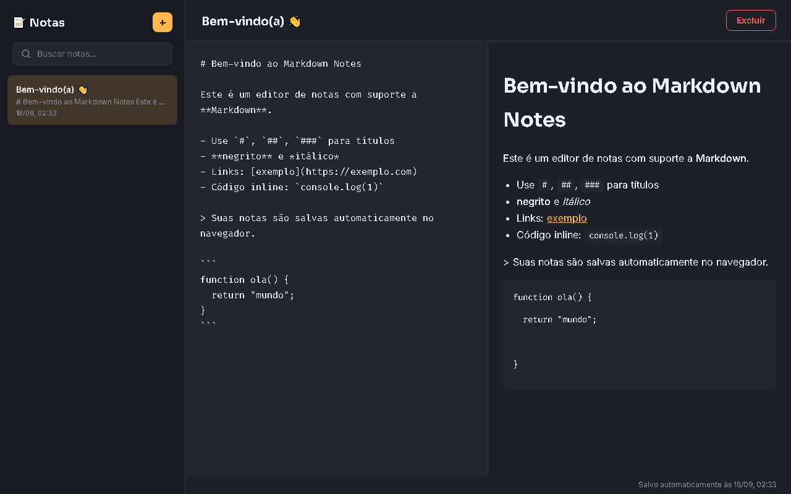

# Markdown Notes

Aplicativo de notas com suporte a **Markdown**, parser próprio escrito em JavaScript puro
(sem bibliotecas externas), busca e persistência local.

## ✨ Funcionalidades

- Criar, renomear (título editável), excluir e buscar notas.
- Editor Markdown com **preview renderizado em tempo real** (split view no desktop, abas Editar/Visualizar no mobile).
- Parser de Markdown próprio cobrindo: `#`/`##`/`###`, **negrito**, *itálico*, listas, links, código inline e blocos de código, citações (`>`).
- Autosave com debounce (salva ~400ms após parar de digitar) em `localStorage`.
- Lista de notas ordenada pela última edição, com preview do conteúdo e data/hora.
- Nota de boas-vindas criada automaticamente na primeira visita, demonstrando a sintaxe suportada.

## 🛠️ Stack

HTML5, CSS3 (Grid, layout responsivo com abas no mobile), JavaScript puro (regex para o parser de Markdown, `localStorage`, debounce).

## ▶️ Como rodar

Abra o `index.html` no navegador, ou use a extensão Live Server no VS Code.
